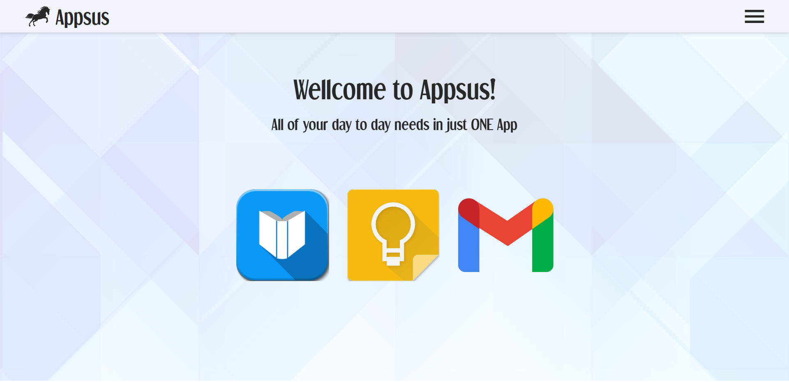
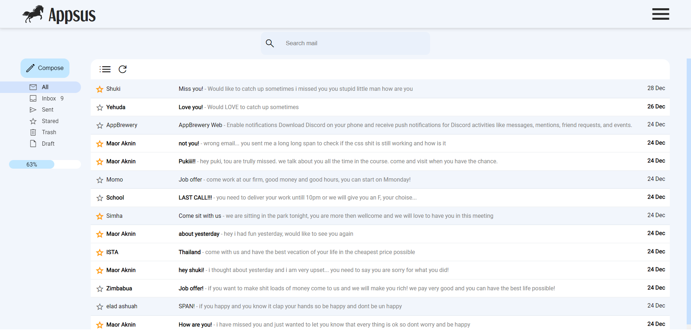
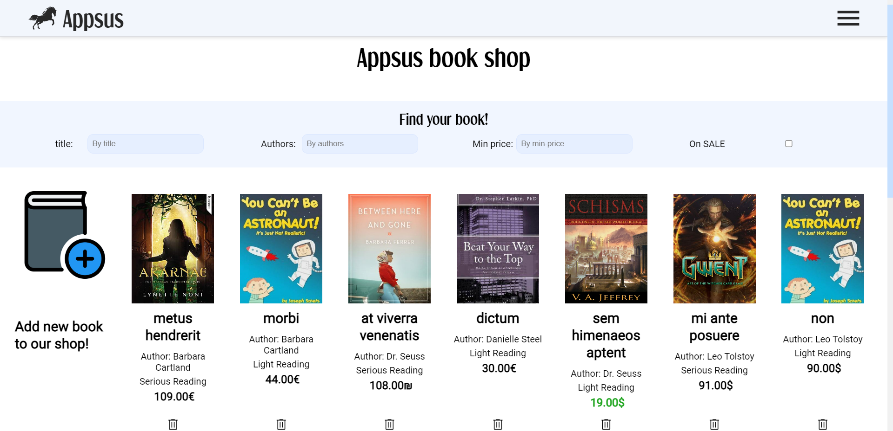
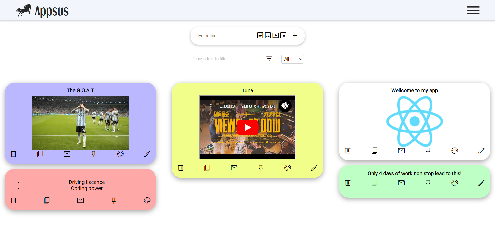

	<h1>Appsus</h1>

My first react project built over a duration of 4 days, Appsus is a single page responsive application with a set of mini apps (mail, note, book) to create for our users the best experience to manage all of their every day needs. [Appsus](https://maoraknin.github.io/AppsusMaorGuy/ "Website link")!

- [Mail App](#mail-app)
- [Book App](#book-app)
- [Note App](#note-app)

## Mail App 

An email client app, with a design inspired by Gmail. The user can view his inbox and other folders, view an email, and compose new emails.

### Features List
- A list of emails display.
- A click on an email opens an email-preview.
- A click on an email-preview opens the email for reading.
- A read/unread state per email.
- An unread emails count display.
- Compose – creating a new email and sending it.
- Filtering emails: by search and by read/unread.
- Sorting emails: by date, subject, starred emails, sent emails and removed emails.
- Manually marking an email as read/unread.
- Manually marking an email as starred.
- When removing an email it is displayed in the trash folder.
- When removing an email from trash folder the email gets truly deleted.
- Add a draft folder – email that is being composed is auto saved every 5 seconds and can be viewed in the draft folder until sent.

## Book App 

A CRUD application which manages a demo book shop. 

### Features List
- Google books API- using the Google books API to fetch a list of books which match
the search term. We used debounce to minimize API calls.
- Reviews- the user can add a review on each book.
- User messages using the event bus
- Routing 

## Note App

An app that keeps notes (inspired by "Google Keep"). 

### Features List
- The ability to create, update and delete notes (CRUD).
- Supports setting the note's background color.
- Supports filtering notes by search.
- There are several types of notes: text,list, image and video.

